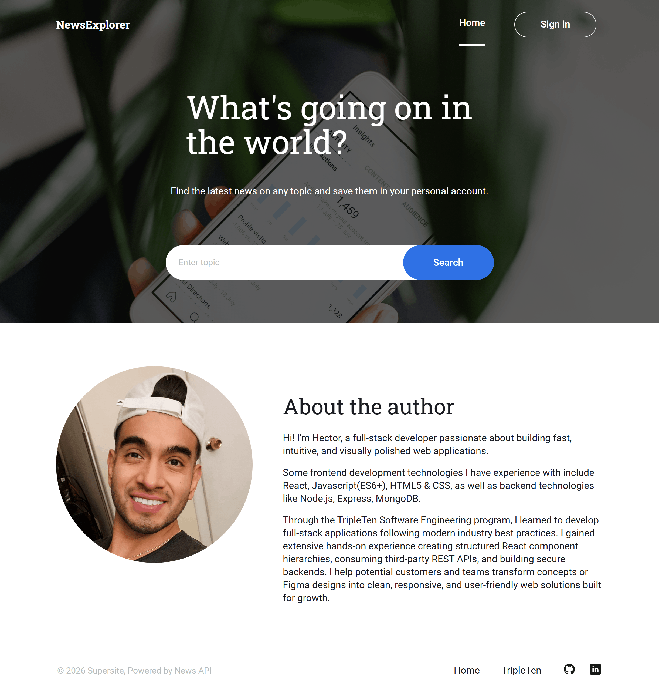
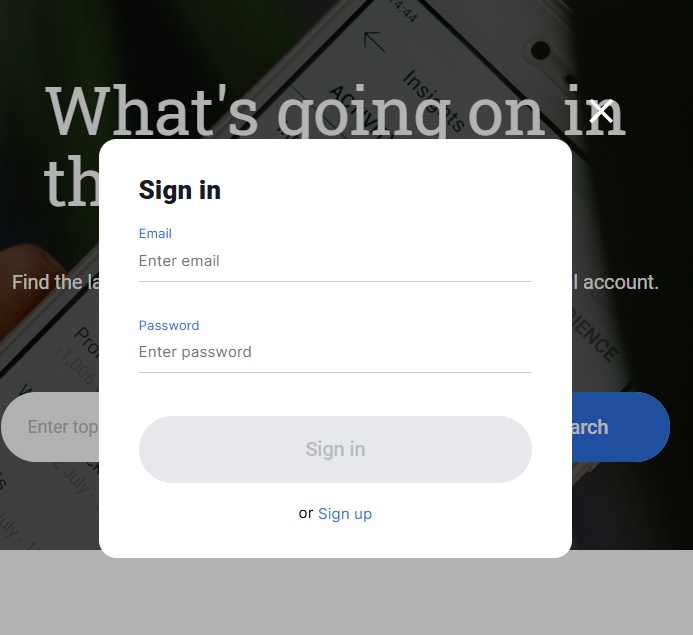
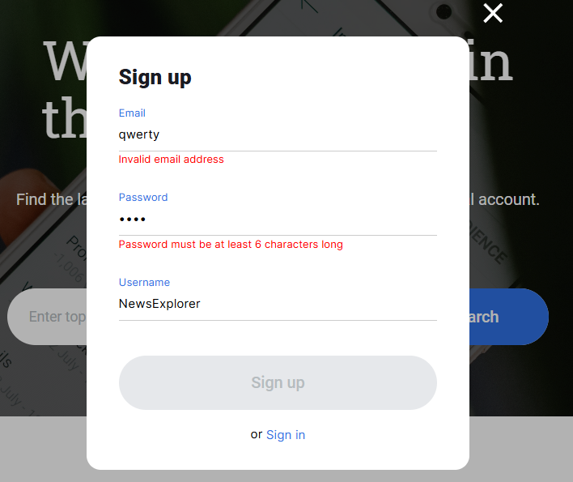
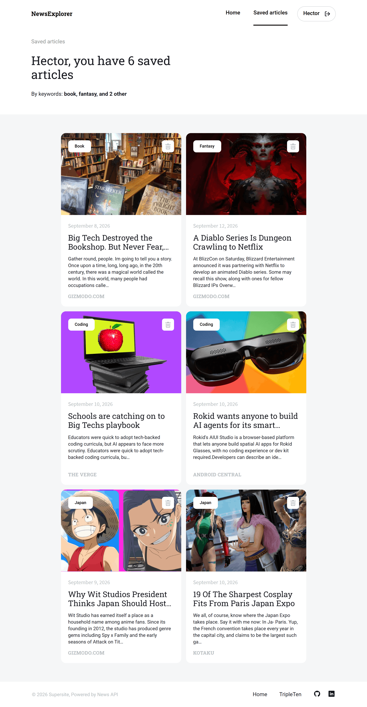
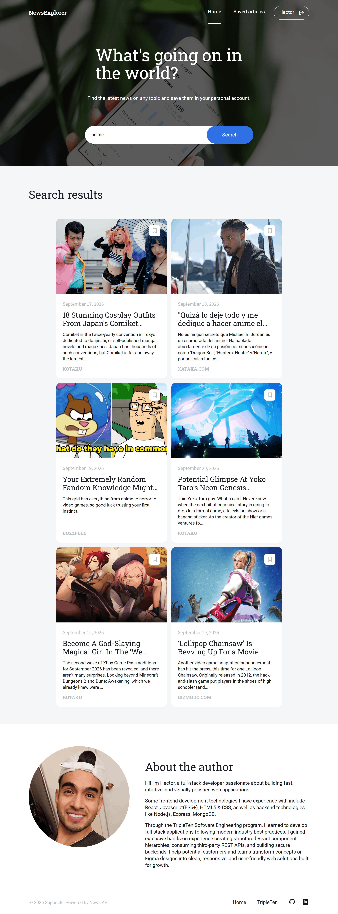
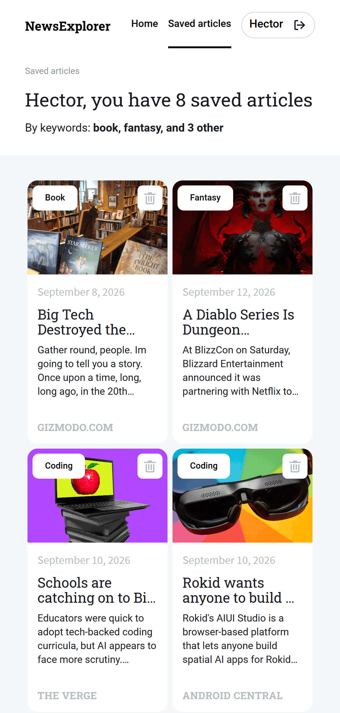
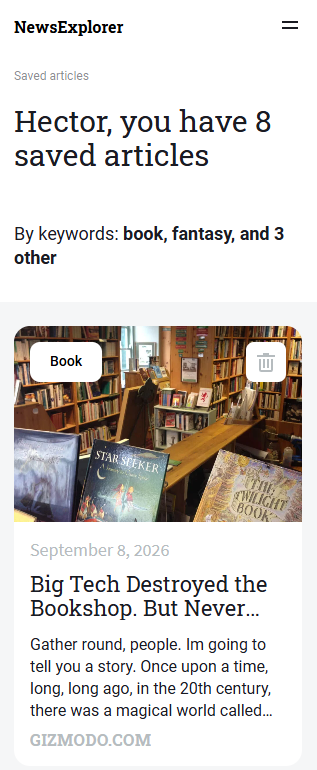
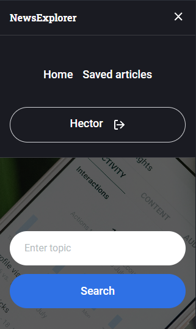
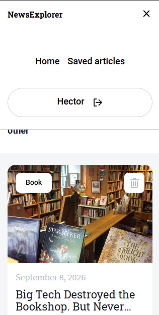

# Final Project: News Explorer

A web application that allows users to search for recent news articles worldwide, save their favorite to a personal profile, and manage saved articles by search keywords.

### Overview

- Intro
- Project Links
- Project Description
- Project Key Features
- Technologies Used
- News Explorer Visuals & Previews
- Plan on improving project

### Intro

This project delivers an interactive news aggregation platform designed to deliver personalized content discovery. Using a search bar, users can search terms worldwide, browse search results with responsive pagination, and manage an individualized collection of saved articles with secure authentication. Built with React, dynamic routing, modular components, and responsive design this project focuses on smooth state management and user-friendly interaction design.

## Project links

- [Frontend Repository link to the project](https://github.com/ihekusmiles/se_project_react)

Check out [this video](VIDEO LINK HERE) where I describe and showcase the News Explorer project and explain some technologies used.

- [Github Page link to the project](https://github.com/ihekusmiles/news_explorer_frontend)

## Project Description

This application communicates with an external third-party API to serve dynamic news content, which is then processed locally and saved dynamically across users views.

## Project Key Features

- **Dynamic Article Search:** Queries the NewsAPI endpoint for news articles published within the last 7 days based on user input.
- **Client-Side Pagination:** Displays articles in groups of 3 with a "Show More" feature, maximizing client performance without redundant network requests.
- **User Authentication & Saved Articles:** Allows registered users to log in, save articles along with their original search keywords, and manager their saved list.
- **Conditional UI Themes:** Features a custom header and navigation behavior that is tailored for both the main search page and the saved news page.
- **Data resiliency & Handling:** Normalizes article data schemas dynamically between raw external API returns and internal saved article data.

## Technologies Used

- **Frontend:** React, React Router, Javascript (ES6+), HTML5, CSS3/BEM Methodology
- **Build Tools & Environment:** Vite React App, Node.js, Git & GitHub
- **API & Asynchronous Data:** Fetch API, News API Integration, Restful endpoints

## News Explorer Visuals & Previews

The main app at 1440px screen resolution:

Users can sign in or sign up to access their own saved news profile.

User input is validated in real time. Sign in button is only enabled once validation is fulfilled.

The saved-news route shows user's saved articles and informs users how many saved articles they have based on the keywords searched.

Saved articles can be deleted from a users profile.

## Responsive Design

Responsive design was implemented for various screen sizes. Elements were also placed differently depending on the screen size.

The saved news page on a tablet:

Main page at mobile view (320px):

Saved news page at mobile view (320px):

Menu on mobile view changes theme depending on the page a user is on:

## Plan on improving project

- Implement a delete article confirmation modal
- Implement "Logged out successfully" confirmation modal
- Implement backend design to make a fullstack application
